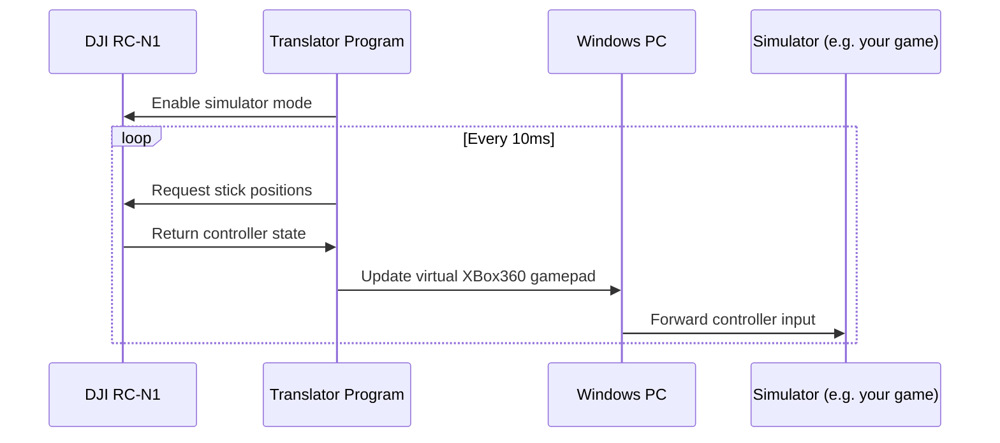

# DJI_RC_Nx_Translator

**This app hasn't been tested at the moment as I don't have the DJI RC Nx series controller at hand.**
**You're welcome to try and submit a pull request if there is an error.s**

The Go implementation of [sparkyws/DJI_RC-N1_SIMULATOR_FLY_DCL](https://github.com/sparkyws/DJI_RC-N1_SIMULATOR_FLY_DCL)

This is a program that connects to your DJI Remote Controller (RC-N1) as a XBox360 gamepad, reads the stick positions and tells Windows that position.

## Features

- Easy-to-use graphical user interface
- Automatic DJI controller detection
- Automatic installation of the ViGEmBus driver
- Compatible with all simulators that support Xbox controllers (Liftoff, Velocidrone, DRL, etc.)
- Camera dial mapped to Y (up) and B (down) buttons for simulator-specific functions

## Installation

- Install necessary USB driver before usage: [dji-assistant-2-consumer-drones-series](https://www.dji.com/downloads/softwares/dji-assistant-2-consumer-drones-series) and close it after installation

### Option 1: Download Pre-built Binary (Recommended)

1. Download the latest release ZIP file from the [Releases](https://github.com/CB2Moon/DJI_RC_Nx_Translator/releases) page
2. Extract the ZIP file to a location of your choice
3. Connect your DJI RC-Nx controller to your PC via USB
4. Run the proper exe file as admin
5. Click the "Start" button to begin translating controller inputs

### Option 2: Build from Source

1. Install Go 1.22.x or later
2. Clone this repository: `git clone https://github.com/CB2Moon/DJI_RC_Nx_Translator.git`
3. Change to the project directory: `cd DJI_RC_Nx_Translator`
4. Run `build.bat` or `build_debug.bat` to build the executable
5. Connect your DJI RC-Nx controller to your PC via USB
6. Run the built executable

## How it works

1. This program listens on the RC input port
2. Sends signal to enable simulator mode for RC (DJI Remote Controller)
    - DUML protocol is used to communicate with DJI devices
3. Sends read signal to RC
4. RC returns controller states, e.g. stick positions, camera, and so on
5. Program converts the data into PC's XBox360 gamepad (created by [`vgamepad-go`](https://github.com/CB2Moon/vgamepad-go) format and tell the PC
6. PC will tell the simulator (e.g. Stream Liftoff) and handles the rest

## Prerequisites

- Windows 10 or 11
- DJI RC-N1 controller
- DJI Assistant 2 installed (for USB drivers)

## Miscellaneous

For debugging, you may use the DJI RC simulator by running
1. `cd simulator`
2. `go run main.go -port <port> -verbose`, where `<port>` is the virtual serial port name you created, e.g. "COM1"
3. Adjust the condition for searching port at "main.go": `if port.IsUSB && port.Product == "DJI USB VCOM For Protocol"`

## License

This project is licensed under the MIT License - see the LICENSE file for details.
